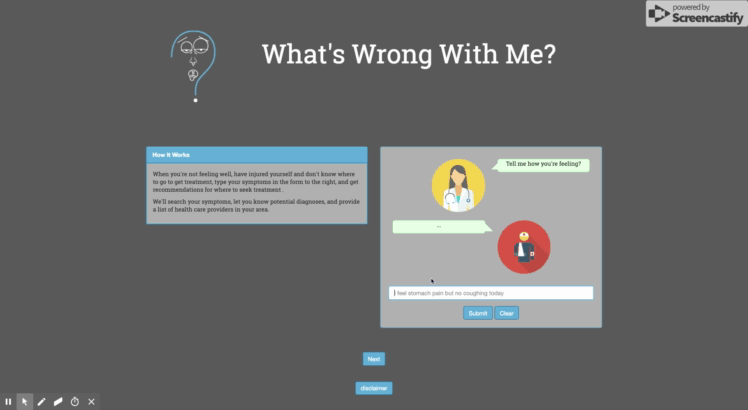

# What's Wrong With Me?

### Instructions:
1. Write a statement about how you're feeling. Using the Infermedica API, keywords in the statement are referenced to predict a diagnosis 
2. Next, Input your gender, age, and zip code so that the BetterDoctor API, can return information about nearby care providers suited to the diagnosis
3. Select a care provider from the options provided for more details about that specific doctor

### Live Project:
[Here](https://sfattal.github.io/W3Me/)

### Team:
- Amy Oconnor 
- Adora Okogeri
- Lennox David
- Sung Hong
- Sherif Fattal